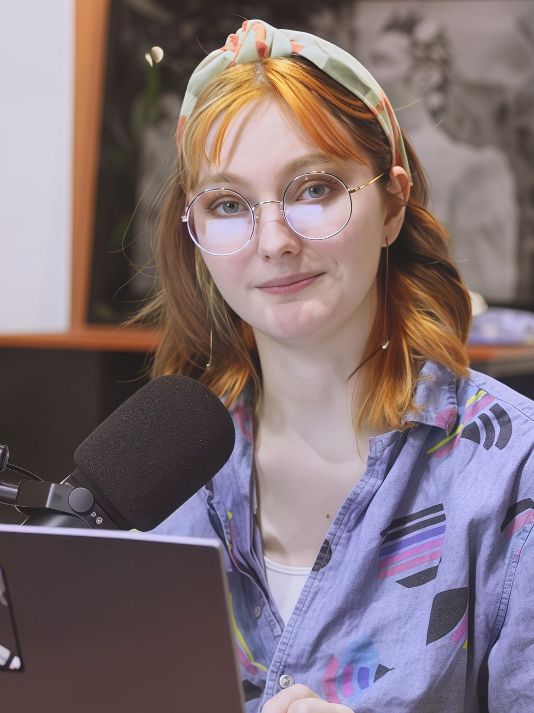

---
# To modify the layout, see https://jekyllrb.com/docs/themes/#overriding-theme-defaults

layout: single
author_profile: false
---

I build brands by building relationships.

I’ve always believed marketing should feel a little more human and a little less corporate. It should feel creative, alive, and actually fun for the people on the other side of the screen.

Whether I’m running multi-platform social channels, talking with community members in the comments, designing graphics, or hosting livestreams, my focus is always the same: figuring out new ways to bring a brand’s personality to life.

I love turning everyday branding into something people actually want to engage with. Because connection starts with engagement.

Let’s make something people actually care about. Together.